```python
import numpy as np
import pandas as pd
import matplotlib.pyplot as plt
import matplotlib.style as style
%matplotlib inline
import seaborn as sns
from scipy import stats

import warnings
warnings.filterwarnings('ignore')

plt.rc('xtick', labelsize = 10)
plt.rc('ytick', labelsize = 10)
plt.rc('axes', labelsize = 12, labelpad = 5)
```

Importing data and data cleaning


```python
df = pd.read_csv('insurance.csv')
```

Looking at a sample of our data it looks like we have 4 numerical features two categorical features and 1 boolean feature.  
Our dependent variable in which we will want to predict is "charges". 


```python
df.sample(5, random_state=12)
```


<div>
<style scoped>
    .dataframe tbody tr th:only-of-type {
        vertical-align: middle;
    }

    .dataframe tbody tr th {
        vertical-align: top;
    }

    .dataframe thead th {
        text-align: right;
    }
</style>
<table border="1" class="dataframe">
  <thead>
    <tr style="text-align: right;">
      <th></th>
      <th>age</th>
      <th>sex</th>
      <th>bmi</th>
      <th>children</th>
      <th>smoker</th>
      <th>region</th>
      <th>charges</th>
    </tr>
  </thead>
  <tbody>
    <tr>
      <th>936</th>
      <td>44</td>
      <td>male</td>
      <td>29.735</td>
      <td>2</td>
      <td>no</td>
      <td>northeast</td>
      <td>32108.66282</td>
    </tr>
    <tr>
      <th>728</th>
      <td>18</td>
      <td>female</td>
      <td>40.280</td>
      <td>0</td>
      <td>no</td>
      <td>northeast</td>
      <td>2217.60120</td>
    </tr>
    <tr>
      <th>1307</th>
      <td>32</td>
      <td>male</td>
      <td>28.120</td>
      <td>4</td>
      <td>yes</td>
      <td>northwest</td>
      <td>21472.47880</td>
    </tr>
    <tr>
      <th>924</th>
      <td>43</td>
      <td>male</td>
      <td>23.200</td>
      <td>0</td>
      <td>no</td>
      <td>southwest</td>
      <td>6250.43500</td>
    </tr>
    <tr>
      <th>137</th>
      <td>22</td>
      <td>male</td>
      <td>25.175</td>
      <td>0</td>
      <td>no</td>
      <td>northwest</td>
      <td>2045.68525</td>
    </tr>
  </tbody>
</table>
</div>


First checking data consistency and format


```python
df.dtypes
```


    age           int64
    sex          object
    bmi         float64
    children      int64
    smoker       object
    region       object
    charges     float64
    dtype: object


```python
df['region'].unique()
```


    array(['southwest', 'southeast', 'northwest', 'northeast'], dtype=object)


```python
df['sex'].unique()
```


    array(['female', 'male'], dtype=object)


```python
df['children'].unique()
```


    array([0, 1, 3, 2, 5, 4])


It looks like our "sex" and "region" features only have a few unique values, we can convert these columns to categorical datatypes for easier analysis. Our 'children' column also only ranges from 1 to 5 so we can treat this as a categorial feature as well.


```python
for col in ['region', 'sex', 'children', 'smoker']:
    df[col] = df[col].astype('category')
```


```python
df.isna().sum()
```


    age         0
    sex         0
    bmi         0
    children    0
    smoker      0
    region      0
    charges     0
    dtype: int64


No null values in this dataset so we don't need to worry about imputation

## EDA

Let's begin our EDA by first analyzing our numerical features, age and bmi

#### Age


```python
df['age'].describe()
```


    count    1338.000000
    mean       39.207025
    std        14.049960
    min        18.000000
    25%        27.000000
    50%        39.000000
    75%        51.000000
    max        64.000000
    Name: age, dtype: float64


```python
fig = plt.figure(figsize = (10,6), facecolor='white')
gs = fig.add_gridspec(1,2)
ax = [None for i in range(2)]
ax[0] = fig.add_subplot(gs[0,0])
ax[1] = fig.add_subplot(gs[0,1])

sns.histplot(
    data = df,
    x = 'age',
    ax = ax[0],
    edgecolor = 'black',
    linewidth = 1.5,
    alpha = 0.8,
    zorder = 2,
    color = ['#1a53ff']
)

stats.probplot(df['age'], dist = 'uniform', plot = ax[1])

ax[0].grid(
    which = 'both',
    axis = 'y',
    zorder = 1,
    color = 'black',
    linestyle = '-',
    dashes = (2,7)
)

for direction in ['top', 'left', 'right']:
    ax[0].spines[direction].set_visible(False)

for direction in ['top', 'right']:
    ax[1].spines[direction].set_visible(False)

ax[0].set_title('Distribution of Ages', pad = 10)
ax[1].set_title('Q-Q plot', pad = 10)

```


    Text(0.5, 1.0, 'Q-Q plot')


    
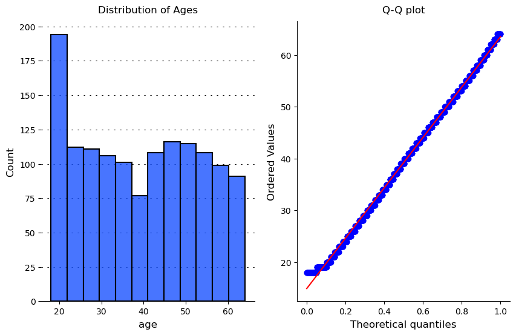
    


Our age distribution is relatively uniform and non-normal, we have a peak around 20 years old and a mean age of ~40  
A quantile-quantile plot of our age distribution shows that this data behaves very similarly to uniformally distributed data.


```python
fig = plt.figure(figsize = (8,6))

ax = sns.scatterplot(
    x = df['age'],
    y = df['charges'],
    s = 40,
    edgecolor = 'black',
    linewidth = 1,
    c = ['#b30000']
)

for direction in ['top', 'right']:
    ax.spines[direction].set_visible(False)

ax.set_title('Slight Positive Correlation Between Age and Charges', pad = 10)
ax.set_ylabel('Charges', labelpad = 15)
ax.set_xlabel('Age', labelpad = 15)
```


    Text(0.5, 0, 'Age')


    
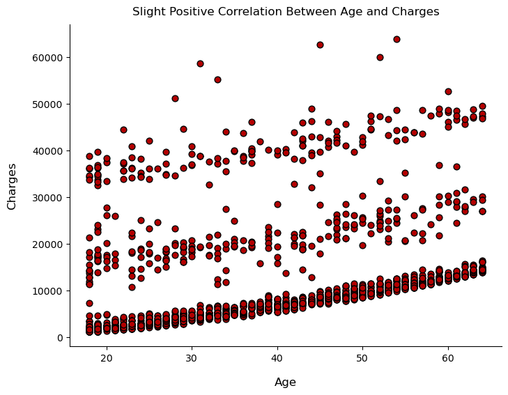
    


There is a slight positive correlation between the mininum amount of charges and the age of our population, however the is still quite a bit of variabity in this relationship above the minimun charges.

### BMI


```python
df['bmi'].describe()
```


    count    1338.000000
    mean       30.663397
    std         6.098187
    min        15.960000
    25%        26.296250
    50%        30.400000
    75%        34.693750
    max        53.130000
    Name: bmi, dtype: float64


```python
fig = plt.figure(figsize = (10,6), facecolor='white')
gs = fig.add_gridspec(1,2)
ax = [None for i in range(2)]
ax[0] = fig.add_subplot(gs[0,0])
ax[1] = fig.add_subplot(gs[0,1])

sns.histplot(
    data = df,
    x = 'bmi',
    ax = ax[0],
    edgecolor = 'black',
    linewidth = 1.5,
    alpha = 0.8,
    zorder = 2,
    color = ['#1a53ff']
)

stats.probplot(df['bmi'], dist = 'norm', plot = ax[1])

ax[0].grid(
    which = 'both',
    axis = 'y',
    zorder = 1,
    color = 'black',
    linestyle = '-',
    dashes = (2,7)
)

for direction in ['top', 'left', 'right']:
    ax[0].spines[direction].set_visible(False)

for direction in ['top', 'right']:
    ax[1].spines[direction].set_visible(False)

ax[0].set_title('Distribution of bmi', pad = 10)
ax[1].set_title('Q-Q plot', pad = 10)
```


    Text(0.5, 1.0, 'Q-Q plot')


    
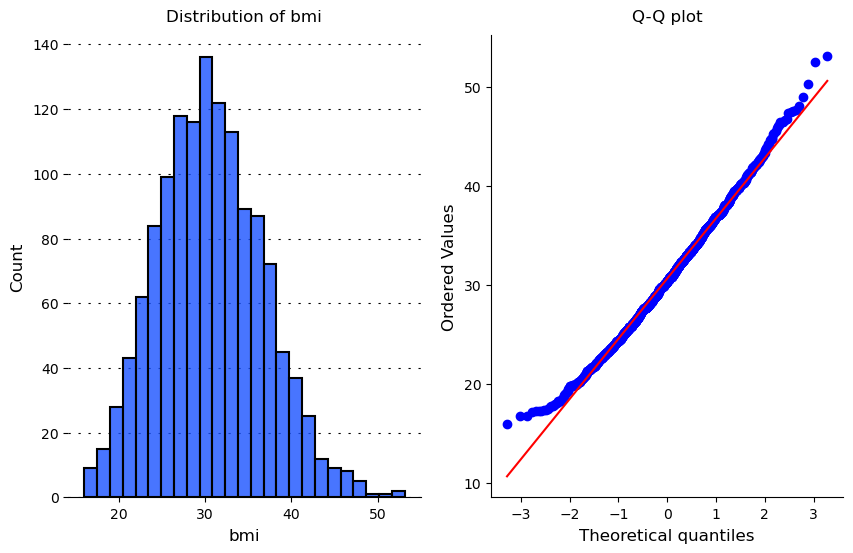
    


We observe that our bmi feature is much more normally distributed, with a slight right skew.  
We have an average bmi of 30 and a slight deviation from a normal distribution at the tails.

We could transform this feature using a box-cox transformation to shift our distribution towards normal


```python
transformed_bmi, lambda_bmi = stats.boxcox(df['bmi'])
```


```python
print('box-cox lambda value:', lambda_bmi)
```

    box-cox lambda value: 0.46059764800652364


```python
fig = plt.figure(figsize = (10,6), facecolor='white')
gs = fig.add_gridspec(1,2)
ax = [None for i in range(2)]
ax[0] = fig.add_subplot(gs[0,0])
ax[1] = fig.add_subplot(gs[0,1])

sns.histplot(
    x = transformed_bmi,
    ax = ax[0],
    edgecolor = 'black',
    linewidth = 1.5,
    alpha = 0.8,
    zorder = 2,
    color = ['#1a53ff']
)

stats.probplot(transformed_bmi, dist = 'norm', plot = ax[1])

ax[0].grid(
    which = 'both',
    axis = 'y',
    zorder = 1,
    color = 'black',
    linestyle = '-',
    dashes = (2,7)
)

for direction in ['top', 'left', 'right']:
    ax[0].spines[direction].set_visible(False)

for direction in ['top', 'right']:
    ax[1].spines[direction].set_visible(False)

ax[0].set_title('Distribution of BMI After Box-Cox Transformation', pad = 10)
ax[1].set_title('Q-Q plot', pad = 10)

ax[0].set_xlabel('BMI (transformed)', labelpad = 10)
```


    Text(0.5, 0, 'BMI (transformed)')


    
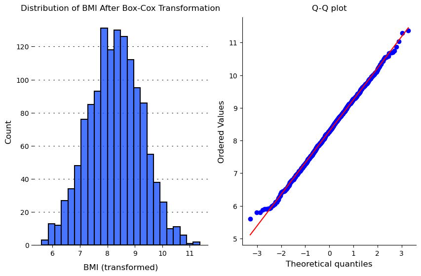
    


After our Box-Cox transformation the distribution of our BMI values is much more normalized.  
We may want to include this tranformation when building our linear model

adding the transformed bmi feature to our dataframe


```python
df['bmi_transformed'] = df['bmi']**lambda_bmi
```


```python
df.head()
```


<div>
<style scoped>
    .dataframe tbody tr th:only-of-type {
        vertical-align: middle;
    }

    .dataframe tbody tr th {
        vertical-align: top;
    }

    .dataframe thead th {
        text-align: right;
    }
</style>
<table border="1" class="dataframe">
  <thead>
    <tr style="text-align: right;">
      <th></th>
      <th>age</th>
      <th>sex</th>
      <th>bmi</th>
      <th>children</th>
      <th>smoker</th>
      <th>region</th>
      <th>charges</th>
      <th>bmi_transformed</th>
    </tr>
  </thead>
  <tbody>
    <tr>
      <th>0</th>
      <td>19</td>
      <td>female</td>
      <td>27.900</td>
      <td>0</td>
      <td>yes</td>
      <td>southwest</td>
      <td>16884.92400</td>
      <td>4.632782</td>
    </tr>
    <tr>
      <th>1</th>
      <td>18</td>
      <td>male</td>
      <td>33.770</td>
      <td>1</td>
      <td>no</td>
      <td>southeast</td>
      <td>1725.55230</td>
      <td>5.058687</td>
    </tr>
    <tr>
      <th>2</th>
      <td>28</td>
      <td>male</td>
      <td>33.000</td>
      <td>3</td>
      <td>no</td>
      <td>southeast</td>
      <td>4449.46200</td>
      <td>5.005229</td>
    </tr>
    <tr>
      <th>3</th>
      <td>33</td>
      <td>male</td>
      <td>22.705</td>
      <td>0</td>
      <td>no</td>
      <td>northwest</td>
      <td>21984.47061</td>
      <td>4.213339</td>
    </tr>
    <tr>
      <th>4</th>
      <td>32</td>
      <td>male</td>
      <td>28.880</td>
      <td>0</td>
      <td>no</td>
      <td>northwest</td>
      <td>3866.85520</td>
      <td>4.707037</td>
    </tr>
  </tbody>
</table>
</div>


```python
fig = plt.figure(figsize = (8,6))

ax = sns.scatterplot(
    x = df['bmi'],
    y = df['charges'],
    s = 40,
    edgecolor = 'black',
    linewidth = 1,
    c = ['#b30000']
)

for direction in ['top', 'right']:
    ax.spines[direction].set_visible(False)

ax.set_title('No Discernible Correlation between BMI and Charges', pad = 10)
ax.set_ylabel('Charges', labelpad = 15)
ax.set_xlabel('BMI', labelpad = 15)
```


    Text(0.5, 0, 'BMI')


    
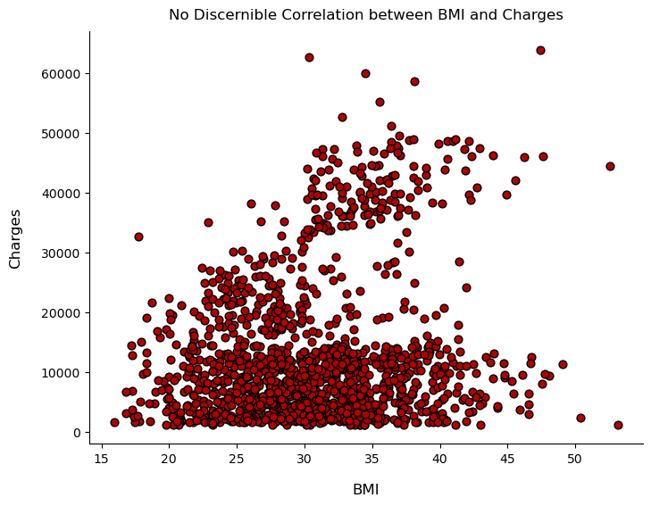
    


There doesn't seem to be an obvious correlation between BMI and charges.  
However we can make out some clusters in our data, lets add in some of our other features.  
Smoking typically comes with negative impacts on health (possible higher charges). Lets include this in our graph


```python
fig = plt.figure(figsize = (8,6))

ax = sns.scatterplot(
    x = df['bmi'],
    y = df['charges'],
    s = 40,
    edgecolor = 'black',
    linewidth = 1,
    hue = df['smoker']
)

for direction in ['top', 'right']:
    ax.spines[direction].set_visible(False)

ax.set_title('Smokers Have Higher Charges', pad = 10)
ax.set_ylabel('Charges', labelpad = 15)
ax.set_xlabel('BMI', labelpad = 15)
```


    Text(0.5, 0, 'BMI')


    
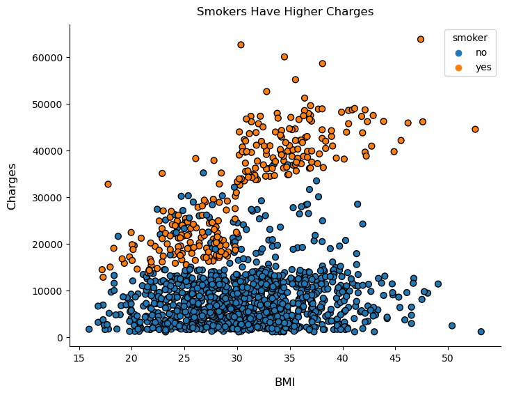
    


We can observe that smoking seems to correlate with higher charges. We can also observe possible interaction terms between smoking and BMI

### Exploring our categorical features

#### Sex


```python
df['sex'].value_counts()
```


    male      676
    female    662
    Name: sex, dtype: int64


We have an equal distribution between male and female patients in our dataset


```python
fig = plt.figure(figsize = (8,6))
ax = sns.boxplot(
    data = df,
    y = 'sex',
    x = 'charges'
)

ax.set_title('No Discernable Correlation Between Sex and Charges', pad = 15)
ax.set_ylabel('Sex')
ax.set_xlabel('Charges')

for dir in ['top','right']:
    ax.spines[dir].set_visible(False)
```


    
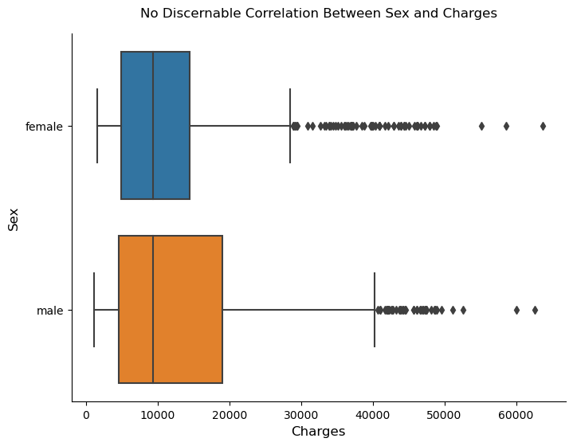
    


It seems like sex may not have much impact on our model if we include it. Male patients tend to have a wider range of charges, however the quartile values are very similar between the two with the only difference being male has a higher 75% quartile.  
I don't think adding this feature into our model will make much of an impact unless there are some interaction terms with other features we can find

#### Children


```python
fig = plt.figure(figsize = (8,6))
ax = sns.countplot(
    data = df,
    x = 'children',
    edgecolor = 'black',
    linewidth = 1.5,
    alpha = 0.9,
    zorder = 2
)

for dir in ['top', 'left', 'right']:
    ax.spines[dir].set_visible(False)

ax.grid(
    which = 'both',
    axis = 'y',
    zorder = 1,
    color = 'black',
    linestyle = '-',
    dashes = (2,7)
)

ax.set_ylabel(None)
ax.set_xlabel('Children')
ax.set_title('Most Patients Have No Children', pad = 20)

ax.bar_label(ax.containers[0], fontweight = 'bold', padding = 3)
plt.show()
```


    
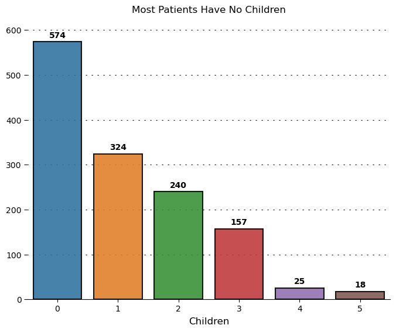
    


```python
fig = plt.figure(figsize = (8,6))
ax = sns.boxplot(
    data = df,
    y = 'children',
    x = 'charges'
)

ax.set_title('Charges May Be Slightly Correlated with Number of Children', pad = 15)
ax.set_ylabel('Children')
ax.set_xlabel('Charges')

for dir in ['top','right']:
    ax.spines[dir].set_visible(False)
```


    
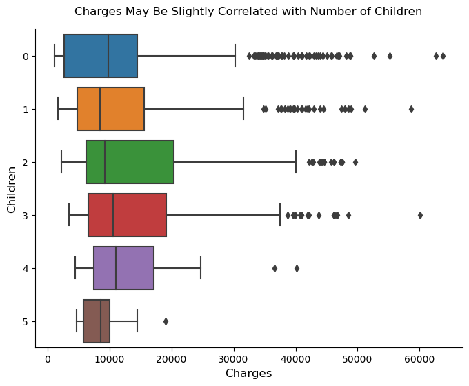
    


We can see there are some slight correlations with the number of children and charges. As the humber of children increase it appears that charges may also increase, however observing the median charges for each category of children we see this relationship isn't very strong.  

A better visualzition for this would be a swarmplot that shows the density of patients for each category.


```python
fig = plt.figure(figsize = (8,6))
ax = sns.swarmplot(
    data = df,
    y = 'children',
    x = 'charges'
)

ax.set_title('Density of Patients by Number of Children', pad = 15)
ax.set_ylabel('Children')
ax.set_xlabel('Charges')

for dir in ['top','right']:
    ax.spines[dir].set_visible(False)
```


    
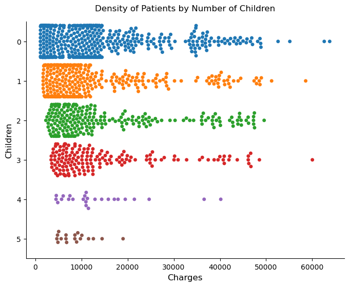
    


We can observe here that the density of patients is very similar across each catergory of number of children and the correlation between charges and children may be minimal.  
However we can see that the lowest amount of charges for each catergory seems to be increasing with the number of children. This can help us predict the "floor" for charges.

Lets see if there may be any interaction terms with age and number of children


```python
fig = plt.figure(figsize = (8,6))

ax = sns.scatterplot(
    x = df['age'],
    y = df['charges'],
    s = 40,
    edgecolor = 'black',
    linewidth = 1,
    hue = df['children']
)

for direction in ['top', 'right']:
    ax.spines[direction].set_visible(False)

ax.set_title('No Interactions Between Age and Children', pad = 10)
ax.set_ylabel('Charges', labelpad = 15)
ax.set_xlabel('Age', labelpad = 15)
```


    Text(0.5, 0, 'Age')


    
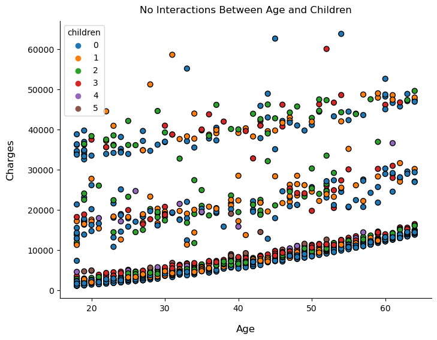
    


There doesn't seem to be any interactions between the two features

### Region


```python
fig = plt.figure(figsize=(8,6))
ax = sns.boxplot(
    data = df,
    x = 'charges',
    y = 'region'
)

ax.set_title('No Discernable Correlation between Region and Charges', pad = 15)
ax.set_ylabel('Region')
ax.set_xlabel('Charges')

for dir in ['top','right']:
    ax.spines[dir].set_visible(False)
```


    
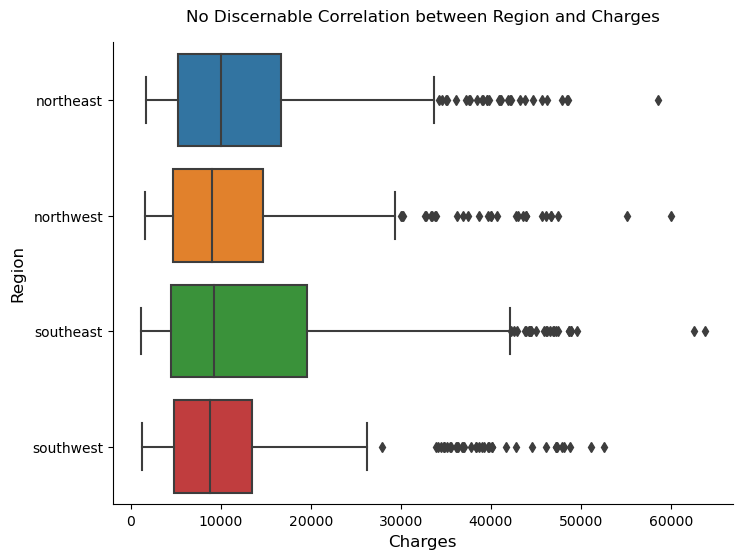
    


We can observe that the median charges across all regions is very similar. The southeast region seems to have the widest range with the highest 75% quartile value for charges of all other regions.  
This could be due to a number of reasons, we know that males have a wider range for charges than female patients so there could be a higher density of male patients in the southeast.  
Lets visualize this


```python
fig = plt.figure(figsize = (8,6))
cont_table = pd.crosstab(index = df['region'], columns = df['sex'],  normalize = 'columns') * 100
ax = sns.heatmap(data = cont_table, cmap = 'Reds', annot=True)
```


    
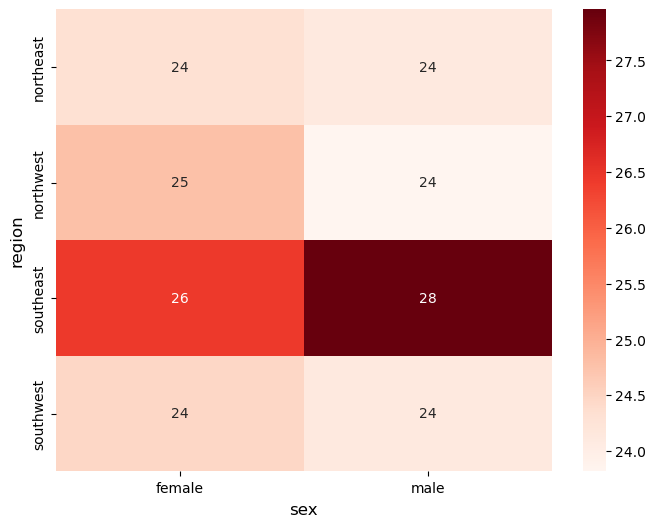
    


It appears from our contingency table that sure enough, 28% of our male patients come from the southeast which is 4% higher than all other regions in our dataset. This is likely a factor into the behavior of our region vs. charges plot above. We may want to include some interaction terms here between sex and region.

#### Smoker


```python
df['smoker'].unique()
```


    ['yes', 'no']
    Categories (2, object): ['no', 'yes']


```python
sns.boxplot(
    data = df,
    x = 'charges',
    y = 'smoker'
)
```


    <AxesSubplot:xlabel='charges', ylabel='smoker'>


    
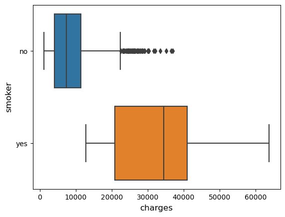
    


We can see that charges and our smoker variable have a high correlation with eachother.  
Logically this follows and our model will likely be highly dependent on this features

### Our dependent variable


```python
df['charges'].describe()
```


    count     1338.000000
    mean     13270.422265
    std      12110.011237
    min       1121.873900
    25%       4740.287150
    50%       9382.033000
    75%      16639.912515
    max      63770.428010
    Name: charges, dtype: float64


```python
fig = plt.figure(figsize = (10,6), facecolor='white')
gs = fig.add_gridspec(1,2)
ax = [None for i in range(2)]
ax[0] = fig.add_subplot(gs[0,0])
ax[1] = fig.add_subplot(gs[0,1])

sns.histplot(
    data = df,
    x = 'charges',
    ax = ax[0],
    edgecolor = 'black',
    linewidth = 1.5,
    alpha = 0.8,
    zorder = 2,
    color = ['#1a53ff']
)

stats.probplot(df['charges'], dist = 'norm', plot = ax[1])

ax[0].grid(
    which = 'both',
    axis = 'y',
    zorder = 1,
    color = 'black',
    linestyle = '-',
    dashes = (2,7)
)

for direction in ['top', 'left', 'right']:
    ax[0].spines[direction].set_visible(False)

for direction in ['top', 'right']:
    ax[1].spines[direction].set_visible(False)

ax[0].set_title('Distribution of charges', pad = 10)
ax[1].set_title('Q-Q plot', pad = 10)
```


    Text(0.5, 1.0, 'Q-Q plot')


    
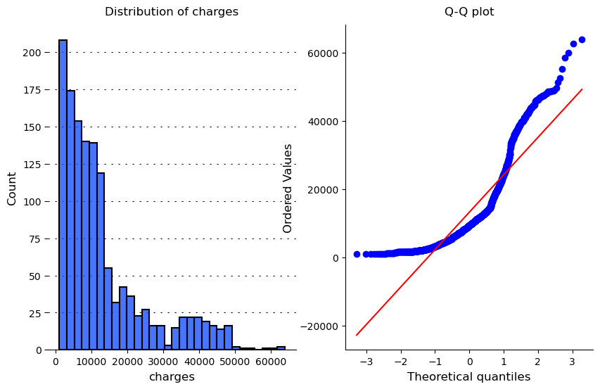
    


Our dependent feature, charges, seems to be heavily skewed right. The majority of charges in our dataset are < 30k with an average of ~13k

We can do another quick box-cox transformation


```python
transformed_charges, lambda_charges = stats.boxcox(df['charges'])
print('lambda value: ', lambda_charges)
```

    lambda value:  0.043649053770664956


```python
df['charges_transformed'] = transformed_charges
```


```python
fig = plt.figure(figsize = (10,6), facecolor='white')
gs = fig.add_gridspec(1,2)
ax = [None for i in range(2)]
ax[0] = fig.add_subplot(gs[0,0])
ax[1] = fig.add_subplot(gs[0,1])

sns.histplot(
    data = df,
    x = 'charges_transformed',
    ax = ax[0],
    edgecolor = 'black',
    linewidth = 1.5,
    alpha = 0.8,
    zorder = 2,
    color = ['#1a53ff']
)

stats.probplot(df['charges_transformed'], dist = 'norm', plot = ax[1])

ax[0].grid(
    which = 'both',
    axis = 'y',
    zorder = 1,
    color = 'black',
    linestyle = '-',
    dashes = (2,7)
)

for direction in ['top', 'left', 'right']:
    ax[0].spines[direction].set_visible(False)

for direction in ['top', 'right']:
    ax[1].spines[direction].set_visible(False)

ax[0].set_title('Distribution of charges', pad = 10)
ax[1].set_title('Q-Q plot', pad = 10)
```


    Text(0.5, 1.0, 'Q-Q plot')


    
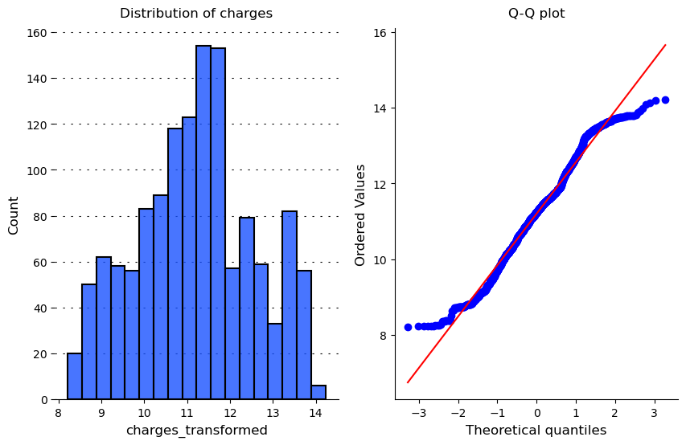
    


From our Q-Q plot we can see that our distribution is closer to normal now

### Exporting our cleaned dataframe 


```python
df.to_csv('cleaned_data.csv', index = False)
```
